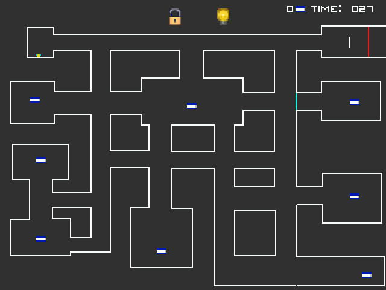

# Escape 079: FPGA Arcade-Style Game

## Table of Contents
1. [Project Overview](#project-overview)
2. [Key Features](#key-features)
3. [Technical Details](#technical-details)
4. [Installation and Setup](#installation-and-setup)
5. [Usage Instructions](#usage-instructions)
6. [Examples and Demos](#examples-and-demos)
7. [Key Contributions](#key-contributions)
8. [Licensing](#licensing)
9. [Contact Information](#contact-information)
10. [Acknowledgments](#acknowledgments)
11. [Future Improvements](#future-improvements)
12. [Challenges and Solutions](#challenges-and-solutions)

## Project Overview

Escape 079 is a two-player arcade-style game designed for the Intel DE1-SoC FPGA board and implemented in C. This project integrates fundamental Computer Organization concepts such as pooling, reading/writing into status/control registers, and interacting with various I/O devices.

### Game Features:
- **PS2 Keyboard**: Human character movement (WASD keys).
- **10 Red LEDs, 10 Switches, 4 Pushbuttons**: In-game interaction.
- **VGA Display**: Double buffering for smooth graphics.
- **Speakers**: Interactive audio effects.

A key challenge was integrating these I/O devices with game logic, particularly in player detection and managing complex movement and collision logic.

## Key Features

### Human Character:
- **Movement**: Controlled via WASD keys.
- **Power-ups**: Collect eight to increase speed.
- **Endgame Challenge**: Solve a 10-bit binary code displayed on LEDs to escape.

### AI Character:
- **Gate Placement**: Blocks paths with gates.
- **Blackout Ability**: Temporarily makes power-ups invisible.

### Gameplay Mechanics:
- **Timer**: 120 seconds for both players.
- **Speed Increase**: Human character's speed increases with power-ups.
- **Endgame Scenarios**: Win/loss screens based on game outcomes.

## Technical Details

### Technologies Used:
- **Programming Language**: C
- **Hardware**: Intel DE1-SoC FPGA board
- **Software**: Intel Quartus Prime for compilation, CPUlator Computer System Simulator for testing

### Components:
- **VGA Display**: Double buffering to achieve 30 fps.
- **PS2 Keyboard**: Custom handling for WASD inputs.
- **LEDs and Switches**: Display binary codes and handle user inputs.

### Challenges and Solutions:
- **Player Detection**: Improved collision detection algorithms.
- **I/O Device Coordination**: Optimized code to manage simultaneous I/O operations.

## Installation and Setup

### Prerequisites:
- Intel DE1-SoC Board
- Intel Quartus Prime Software
- PS2 Keyboard
- VGA Display and Speakers

### Setup Instructions:

**Using CPUlator Computer System Simulator:**
1. Visit [CPUlator](https://cpulator.01xz.net/).
2.  Set `Language:` to `C` by clicking on the dropdown menu at the top of the UI.\
3.  Download the `concatenatedMainFile.c` file from the repository.
4.  Copy the source code from the file and paste it into the CPUlator simulator.
5.  Click on `Compile and Load` button at the top to compile the code.
6.  Uncheck all boxes under `Debugging Checks` section located on the left.
7.  Press `Continue` button at the top to run the code.
8.  Refer to `Devices` section on the right to use I/O devices.


**Using Intel Quartus Prime Software:**
1. Clone the repository:
    ```bash
    git clone https://github.com/yourusername/Escape079.git
    ```
2. Navigate to the project directory:
    ```bash
    cd Escape079
    ```
3. Create a new project in Intel Quartus Prime.
4. Add all `.c` files (excluding `concatenatedMainFile.c`).
5. Compile and upload to the DE1-SoC board.
6. Connect the PS2 keyboard, VGA display, and speakers.

## Usage Instructions

### Controls:

**Human Character:**
- **`W`**: Move Up
- **`A`**: Move Left
- **`S`**: Move Down
- **`D`**: Move Right
- **`Space`**: Start the game

**AI Character:**
- **`KEY0`**: Shift to next gate location
- **`KEY1`**: Shift to previous gate location
- **`KEY2`**: Lock highlighted gate location
- **`KEY3`**: Blackout (turn off lights)

### Gameplay:
- **Human Character**: Collect all 8 power-ups and solve the 10-bit binary code to escape.
- **AI Character**: Use gates and blackouts to stall the human player and prevent escape.

### Strategies:
- **Human Player**: Collect power-ups quickly to increase speed and evade AI traps.
- **AI Player**: Place gates and use blackouts strategically to hinder the human player.

## Examples and Demos

This section showcases various gameplay scenarios in **Escape 079** with accompanying screenshots and descriptions to illustrate key aspects of the game.

### 1. Start Screen


**Description**: The start screen instructs the player to press the space button to begin the game. This screen sets the stage for the gameplay by providing initial instructions.

---

### 2. Initial Game State


**Description**: This screenshot shows the initial state of the game with the player positioned at the top left of the map. The 8 power-ups are scattered across the map, and the player starts exploring the environment.

---

### 3. AI Character Gate Placement



**Description**: The AI character is moving the gate indicator to a new location on the map (indicated by cyan). This screenshot shows the AI planning its strategy to block the human player.

---

### 4. Gate Confirmation


**Description**: The AI character confirms and builds a gate, which is shown in red. The lock icon at the top changes from open to closed, indicating that the gate-blocking ability has been used.

---

### 5. Closed Gate Obstacle


**Description**: The human player encounters a closed (red) gate and cannot pass through. This image demonstrates how gates block the player's path and add challenge to the game.

---

### 6. Blackout Effect


**Description**: The AI character activates the blackout ability, making all power-ups invisible. Notice that the lightbulb icon at the top turned off, indicating that the blackout ability was used. This screenshot illustrates the temporary constraint imposed on the human player.

---

### 7. Power-Ups and Binary Pin


**Description**: The human player has collected all 8 power-ups, as shown by the count at the top right. The randomly generated 10-bit binary pin is displayed at the bottom left, and the same code is shown on the red LEDs.

---

### 8. HEX Display Timer


**Description**: The HEX display shows the remaining time out of the 120 seconds for the match. The time is also shown at the top right of the map, making it more accessible for both players to be aware of the remaining time.

---

### 9. Entering Binary Pin


**Description**: The human character is entering the 10-bit binary pin using the switches. Each LED position (lit or off) corresponds to the switch setting needed to match the binary code.

---

### 10. Player Wins End Screen


**Description**: The player successfully collected all power-ups, entered the binary pin correctly, and escaped within the time limit. This end screen celebrates the player’s victory.

---

### 11. AI Wins End Screen


**Description**: If the time runs out before the human player escapes, the AI wins. This end screen is displayed when the player fails to meet the objectives in time.

## Key Contributions

- Implemented dynamic 10-bit pin generation and endgame transitions.
- Developed interactive UI features for AI abilities.
- Optimized movement and collision detection.
- Integrated HEX displays for game time countdown.

## Licensing

This project is a personal educational endeavor. It is not licensed for public distribution or modification. External use must credit the author (Koosha Omidian).

## Contact Information

Author: Koosha Omidian  
Email: Koosha.omidian@mail.utoronto.ca

For any inquiries or feedback, please reach out via email.

## Acknowledgments

- **Intel**: For providing the DE1-SoC FPGA board.
- **CPUlator**: For offering a simulation platform.
- **Visual Studio Code & Intel Quartus Prime**: For development tools.
- **Partner**: Acknowledgment to my partner for their contributions.

## Future Improvements

- **Visual Enhancements**: Add more maps and improve graphics.
- **Audio Features**: Integrate advanced sound effects.
- **Extended Content**: Develop additional power-ups and characters.
- **3D Implementation**: Transition to a game engine for 3D graphics and online gameplay.

## Challenges and Solutions

- **Player Detection**: Enhanced collision detection algorithms for accurate movement handling.
- **I/O Device Coordination**: Optimized code to manage multiple I/O devices, reducing latency and improving performance.
